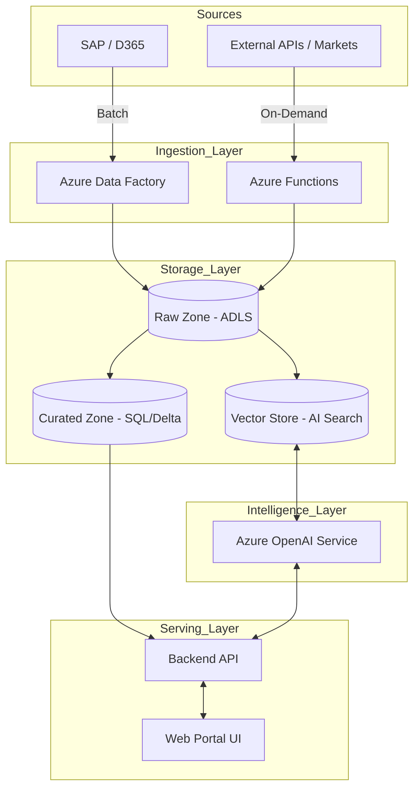

# Architecture Overview: SATS Data Platform

## Executive Summary

The SATS Data Platform is a modern, cloud-native solution built on **Microsoft Azure**, designed to enable the **Strategic Sourcing AI Agent**. It follows an "Analysis-First" principle, leveraging a **Lakehouse architecture** to combine the flexibility of a data lake for unstructured supplier documents with the governance of a data warehouse for structured financial data.

## Major Components

1. **Ingestion Layer**: Hybrid model supporting scheduled batch loads (SAP/D365) via **Azure Data Factory** and on-demand real-time fetching via **Azure Functions**.
2. **Storage Layer (Lakehouse)**: **ADLS Gen2** serving as the unified storage backbone, organized into Raw, Curated, and Knowledge zones.
3. **Intelligence Layer**: **Azure OpenAI Service** for RAG-based reasoning and **Azure AI Search** for vector retrieval of supplier documents.
4. **Serving Layer**: **Azure SQL Database** (or Synapse) for structured recommendations and a React-based **Web Portal** for user interaction.

## High-Level Architecture

## Key Design Principles

1. **Separation of Compute & Storage**: Scaling AI processing independently of data storage costs.
2. **Zero Trust Security**: Strict identity-based access (Azure AD) for all components.
3. **Auditability**: Every AI recommendation is linked to its source data (Source-to-Insight tracing).
